# Enterprise Systems Infrastructure & Identity Management (AD DS)

A comprehensive hands-on implementation of a secure, automated, and centralized enterprise IT infrastructure for **LankaCorp Solutions**. This project demonstrates the deployment of Windows Server 2022 as a Primary Domain Controller, automated user provisioning via PowerShell, strict security compliance using Group Policy Objects (GPOs), and isolated file-sharing storage.

---

## Project Architecture & Scope
The goal of this deployment was to eliminate decentralized user management, enforce corporate security baselines, and protect intellectual property from data leaks.

* **Operating System:** Windows Server 2022 Datacenter
* **Domain Name:** `lankacorp.local`
* **Network Scope:** `10.0.2.0/24`
* **Core Technologies:** AD DS, DNS, DHCP, PowerShell Automation, GPO, NTFS Security.

---

## Baseline Server Configuration (Pre-Requisites)

Before deploying any roles, a static IP configuration was established on the Windows Server to ensure persistent network identity and prevent domain-wide authentication failures.

#### Primary Server Network Properties
* **Objective:** Assign permanent network identifiers to the Domain Controller.
* **Server Navigation Path:** `Control Panel ➡️ Network and Internet ➡️ Network Connections ➡️ Right-Click Adapter ➡️ Properties ➡️ IPv4 Properties`
* **Configuration Screenshot:**  
  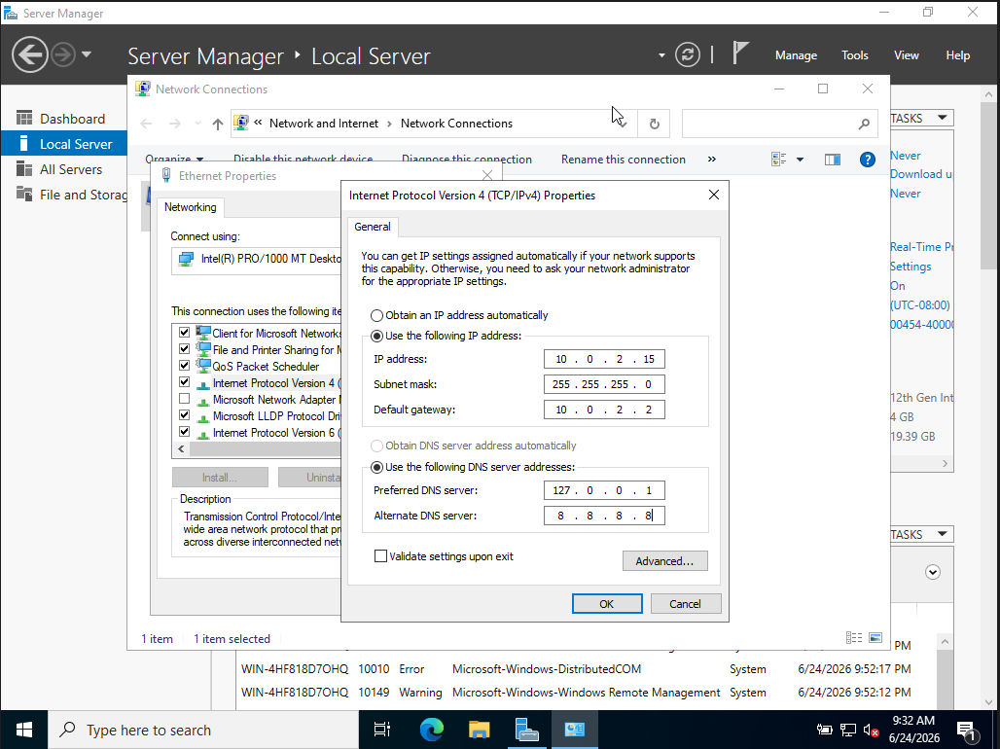

---

#### LAB..

#### 01: Active Directory Domain Services (AD DS) & DNS Deployment
* **Objective:** Establish the centralized root identity zone for the corporation.
* **Implementation:** Configured a Primary Domain Controller running `lankacorp.local` and integrated DNS roles to ensure local name resolution.
* **Server Navigation Path:** `Server Manager Dashboard ➡️ Tools ➡️ Active Directory Users and Computers`
* **Implementation Screenshot:**  
  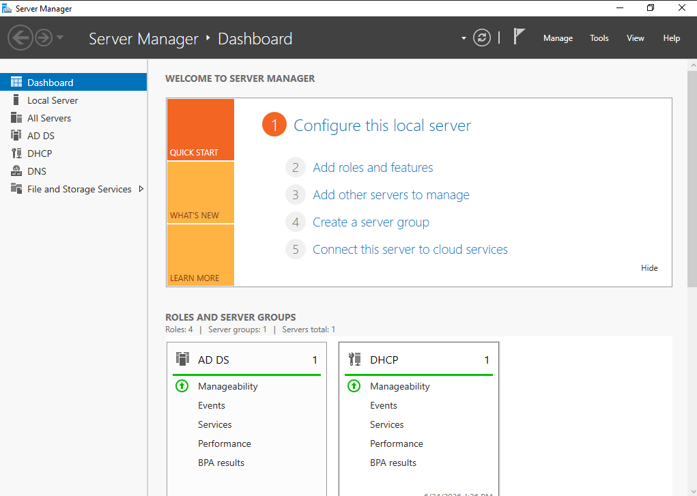

#### 02: DHCP Server Configuration
* **Objective:** Automate network configuration and prevent manual static IP conflicts.
* **Implementation:** Deployed a corporate DHCP scope allocating addresses dynamically from `10.0.2.50` to `10.0.2.200` with the Domain Controller assigned as the preferred DNS server.
* **Server Navigation Path:** `Server Manager ➡️ Tools ➡️ DHCP ➡️ Expand Server ➡️ IPv4 ➡️ Scope [10.0.2.0] LankaCorp_Scope ➡️ Address Pool`
* **Implementation Screenshot:**  
  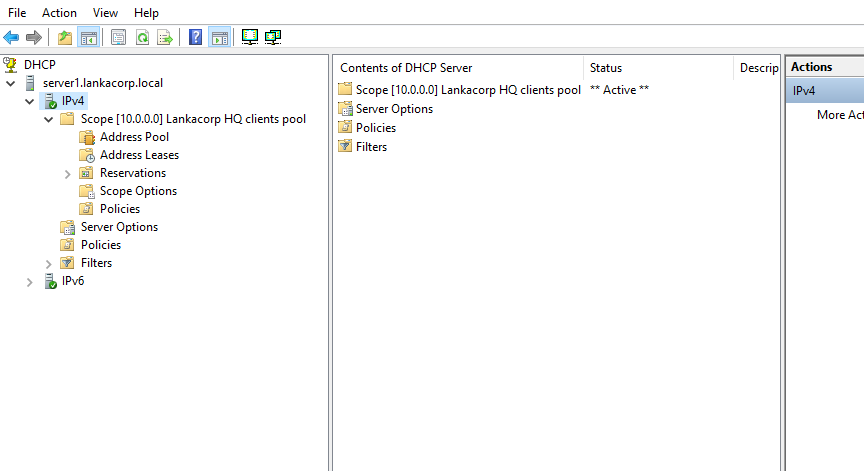

#### 03: Automated Bulk User Provisioning via PowerShell
* **Objective:** Eliminate manual creation errors and securely onboard 100+ employees instantaneously.
* **Implementation:** Developed and executed an advanced PowerShell script that reads employee attributes from a master `.csv` file, structures them into dedicated Departmental Organizational Units (OUs - `IT`, `HR`, `Finance`), and auto-generates randomized compliant passwords.
* **Server Navigation Path:** `Start ➡️ Windows PowerShell ISE (Run as Administrator)` & Verification via `Server Manager ➡️ Tools ➡️ Active Directory Users and Computers ➡️ LankaCorp_HQ OU`
* **Implementation Screenshot:**  
  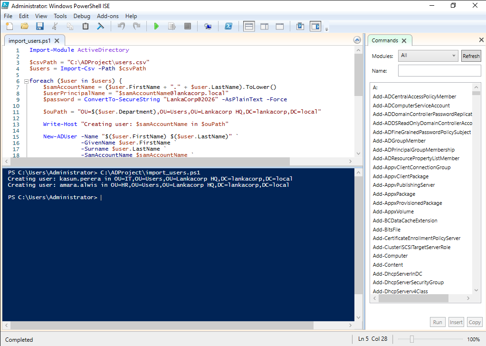

  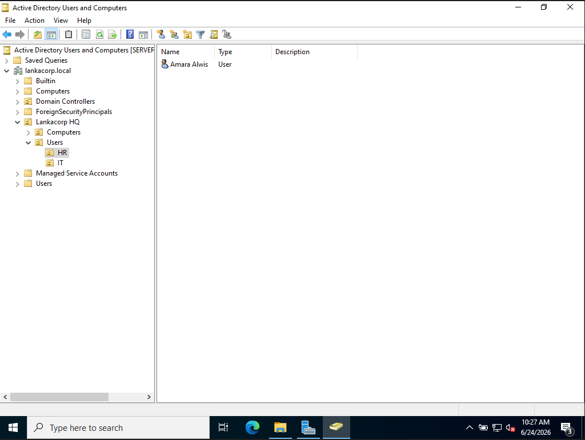

#### 04 & 05: Password Complexity & Account Lockout Guardrails
* **Objective:** Prevent weak password vulnerabilities and mitigate Brute-Force attacks.
* **Implementation:** Enforced domain-wide strict password complexity requiring alphanumeric + special characters with an 8-character minimum. Configured an Account Lockout Threshold of 3 failed attempts, auto-locking accounts for 15 minutes.
* **Server Navigation Path:** `Server Manager ➡️ Tools ➡️ Group Policy Management ➡️ Forest ➡️ Domains ➡️ lankacorp.local ➡️ Default Domain Policy (Right-click Edit) ➡️ Computer Configuration ➡️ Policies ➡️ Windows Settings ➡️ Security Settings ➡️ Account Policies ➡️ Password Policy / Account Lockout Policy`
* **Implementation Screenshot:**  
  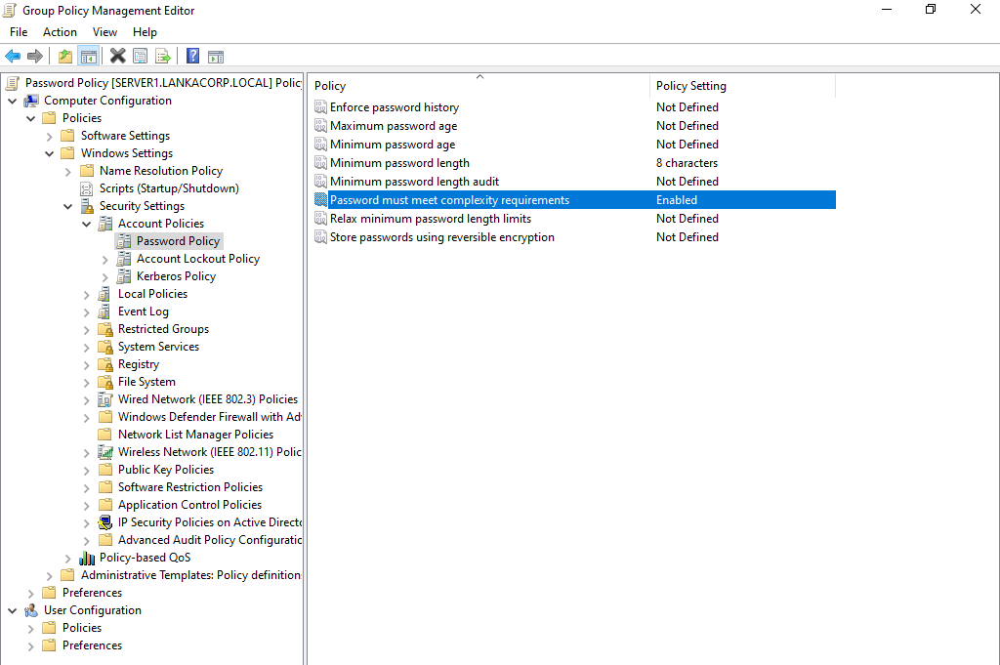

  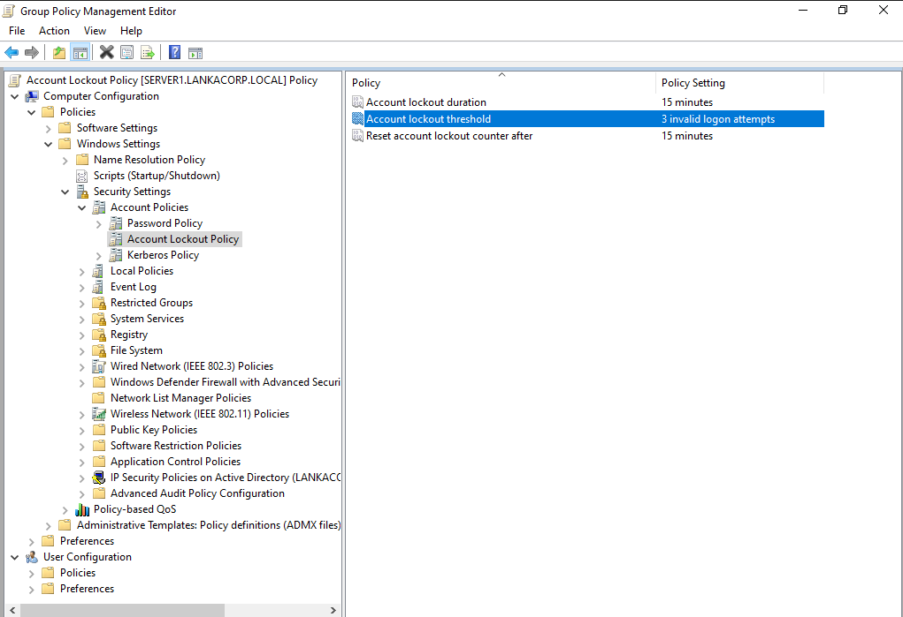

#### 06: Corporate Desktop Wallpaper Standardization
* **Objective:** Uniform corporate branding and prevention of unauthorized localized display modifications.
* **Implementation:** Enforced a centralized, non-modifiable high-resolution desktop wallpaper via GPO linked via a secure network shared path (`\\SERVER1\CompanyFiles\wallpaper.jpg`).
* **Server Navigation Path:** `Group Policy Management Editor ➡️ User Configuration ➡️ Policies ➡️ Administrative Templates ➡️ Desktop ➡️ Desktop ➡️ Desktop Wallpaper`
* **Implementation Screenshot:**  
  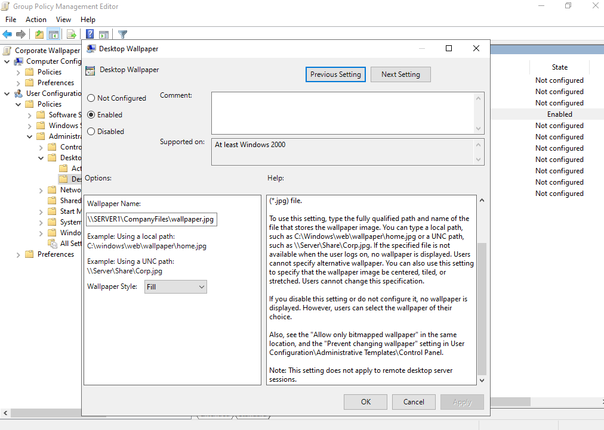

#### 07: Control Panel & Settings Restrictions
* **Objective:** Prevent standard users from manipulating critical network adapters or system settings.
* **Implementation:** Deployed a restrictive policy targeting standard departmental OUs to completely block access to the Windows Control Panel and Settings App.
* **Server Navigation Path:** `Group Policy Management Editor ➡️ User Configuration ➡️ Policies ➡️ Administrative Templates ➡️ Control Panel ➡️ Prohibit access to Control Panel and PC settings`
* **Implementation Screenshot:**  
  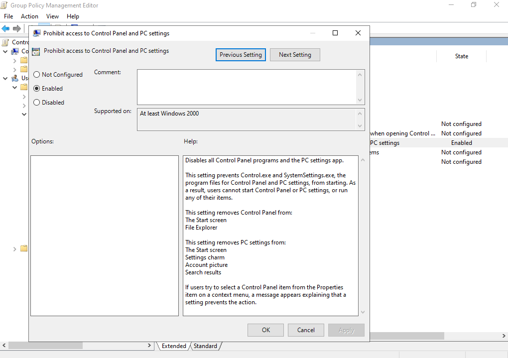

#### 08: USB Storage Disabling (Data Leak Prevention - DLP)
* **Objective:** Stop internal data theft and mitigate malware introduction via physical external drives.
* **Implementation:** Configured an explicit GPO rule: `All Removable Storage classes: Deny all access` to block storage drives while maintaining input peripheral (mouse/keyboard) functionality.
* **Server Navigation Path:** `Group Policy Management Editor ➡️ Computer Configuration ➡️ Policies ➡️ Administrative Templates ➡️ System ➡️ Removable Storage Access ➡️ All Removable Storage classes: Deny all access`
* **Implementation Screenshot:**  
  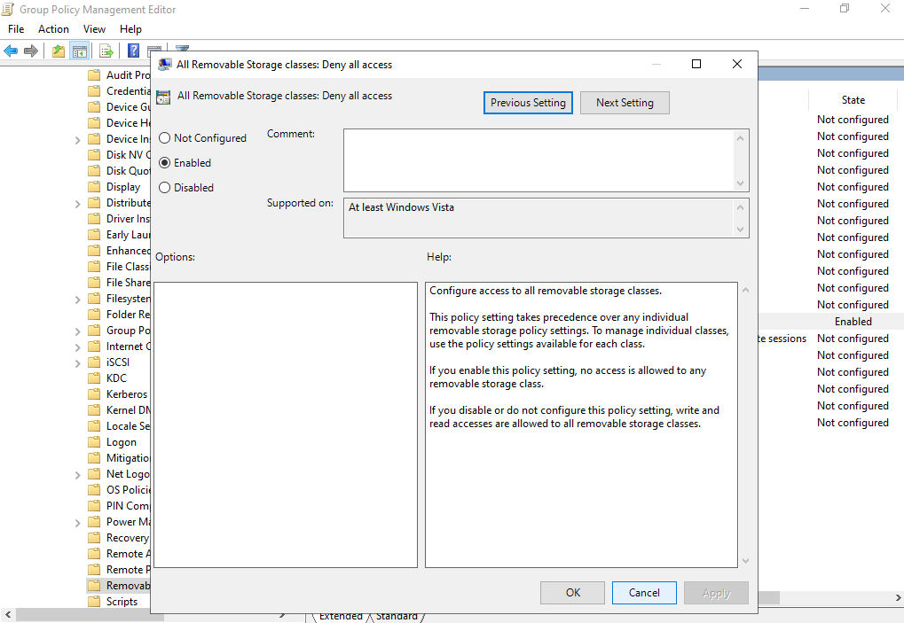

#### 09: Centralized File Server Deployment & NTFS Permission Isolation
* **Objective:** Create a structured data storage repository ensuring strict cross-departmental privacy.
* **Implementation:** Configured `LankaCorp_Shares` with specific sub-folders (`IT_Data`, `HR_Data`). Revoked standard inheritance privileges and applied explicit NTFS security permissions granting access strictly to respective Active Directory Security Groups.
* **Server Navigation Path:** `File Explorer ➡️ This PC ➡️ Local Disk (C:) ➡️ LankaCorp_Shares ➡️ Right-Click Department Folder ➡️ Properties ➡️ Security Tab ➡️ Advanced`
* **Implementation Screenshot:**  
  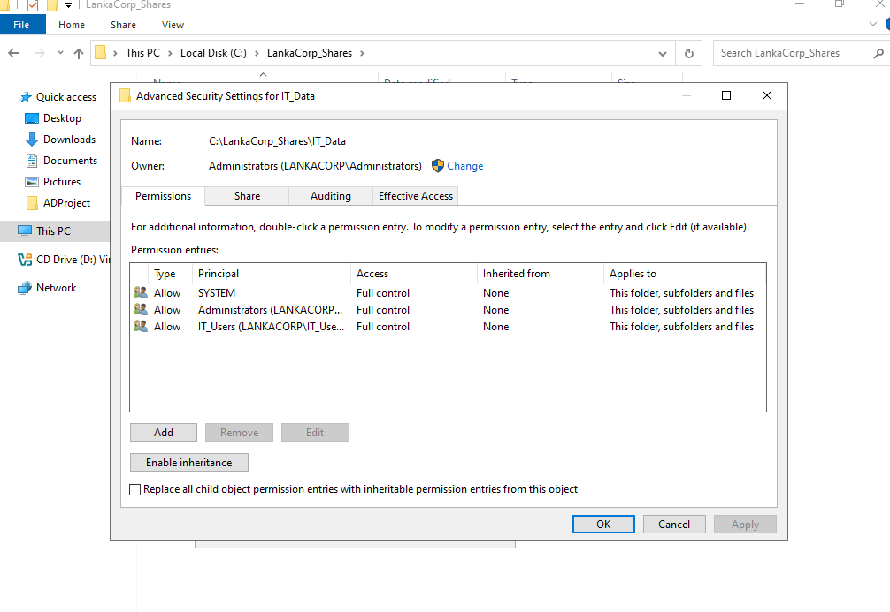

  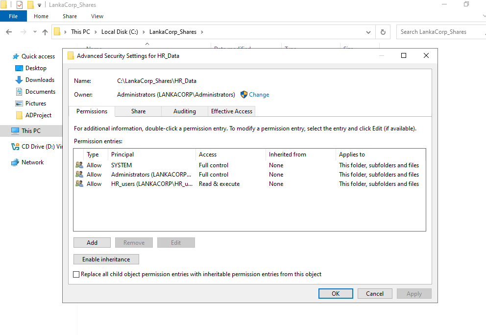

#### 10: Automatic Network Drive Mapping
* **Objective:** Give users seamless access to company shares without typing network paths.
* **Implementation:** Provisioned GPO Preferences to automatically map the corporate file share path (`\\SERVER1\LankaCorp_Shares`) to the client machine as a persistent **`Z: Drive`** upon authentication.
* **Server Navigation Path:** `Group Policy Management Editor ➡️ User Configuration ➡️ Preferences ➡️ Windows Settings ➡️ Drive Maps ➡️ Right-click New Mapped Drive`
* **Implementation Screenshot:**  
  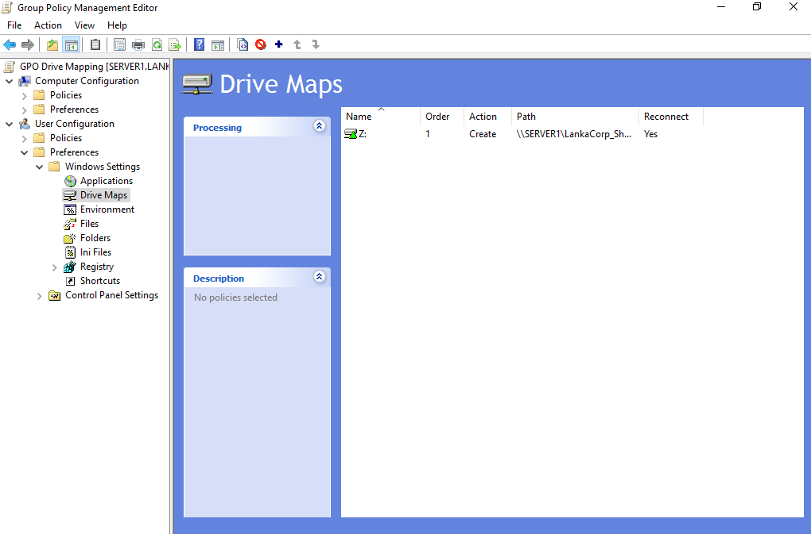

#### 11: Enterprise Folder Redirection (User Backup Infrastructure)
* **Objective:** Secure localized endpoint data against hardware crashes or device loss.
* **Implementation:** Redirected the core user profile directories (`Desktop` and `Documents`) directly to a secure centralized file share path (`\\SERVER1\UserBackups\%username%`). User files are dynamically synced silently in the background to ensure data resilience.
* **Server Navigation Path:** `Group Policy Management Editor ➡️ User Configuration ➡️ Policies ➡️ Windows Settings ➡️ Folder Redirection ➡️ Desktop / Documents ➡️ Right-click Properties`
* **Implementation Screenshot:**  
  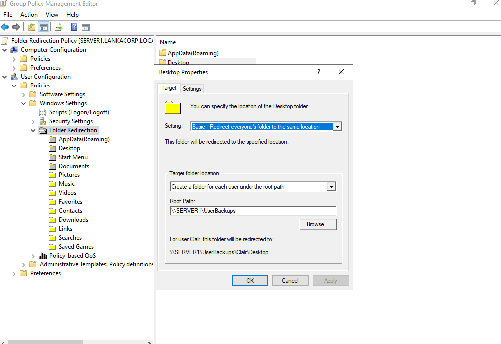
